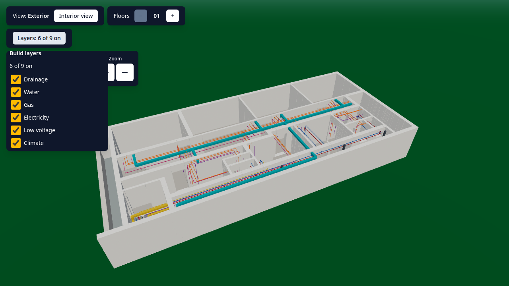
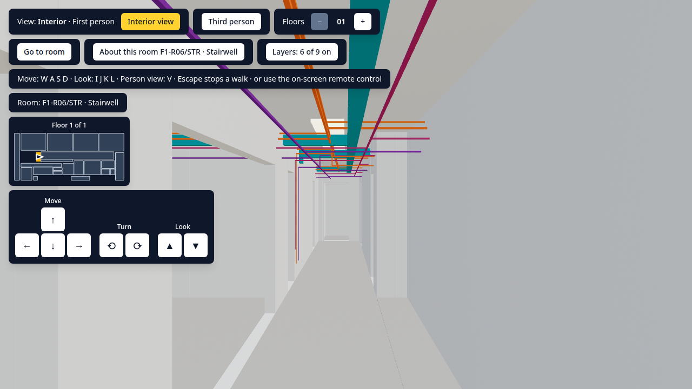
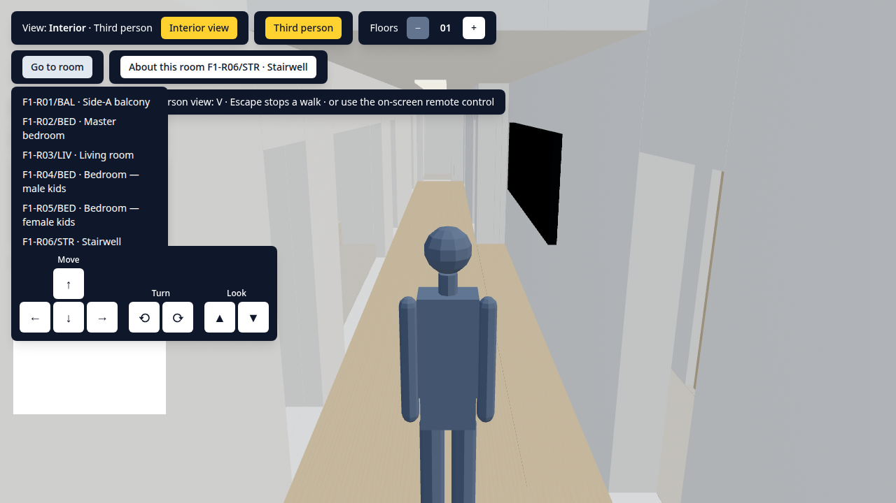

# floor

> One apartment floor of a building, modelled to the centimetre and explored in the browser —
> walked room by room in first or third person, stacked one to ten storeys, built up a layer at
> a time from naked walls to the finish, and generated in its entirety from a single file of
> numbers.

The floor is 22.50 × 10.00 m on a 225.00 m² plot: 21 spaces, 92 walls, 19 doors and openings,
8 windows, 44 fixtures and 116 runs of drainage, water, gas, electricity, low voltage and
climate. Nothing about it is modelled by hand. The walls, the slabs, the stairs, the railings,
the window and door openings, the furniture and every pipe and cable are all derived from the
plan, and so is the architectural drawing that shows it — which is why the two cannot disagree.

It opens as a stack of build layers rather than as a finished object. With nothing ticked you
get **naked walls** — structure, slabs and ceilings, no service and no finish — and nine
checkboxes build it back up in the order a building is actually built: drainage, water, gas,
electricity, low voltage, climate, the covers boxing the runs in, the furniture, the finish.
The layers are additive, never exclusive, so water over naked walls, then water and gas
together, then everything but the finish, is how the floor is meant to be read.

## Controls

The interior view is a focusable region: tab to **Interior view**, press Enter, and the keys
below work while it holds focus. Every one of them also has an on-screen button, because a
keyboard is not always available.

|                      | Keys                          | On screen                                                                |
| -------------------- | ----------------------------- | ------------------------------------------------------------------------ |
| Walk                 | `W` `A` `S` `D`               | the remote-control pad                                                   |
| Turn                 | `J` `L`                       | the remote-control pad                                                   |
| Look                 | `I` `K`                       | the remote-control pad                                                   |
| First / third person | `V`                           | **Third person**                                                         |
| Orbit the outside    | arrow keys and `+` `−`        | the camera pad                                                           |
| Go to a room         | —                             | **Go to room**, then pick one — it walks there through the real doorways |
| Stop walking         | `Escape`, or any movement key | **Stop walking**                                                         |
| Build layers         | —                             | **Layers**, then a checkbox per level — `Escape` closes the panel        |
| Storeys              | —                             | `[−] 01 [+]`                                                             |

Full detail, including what happens at a phone width and the exact tab order, is in
[`docs/RUNBOOK.md`](docs/RUNBOOK.md#controls).

## The sources of truth

The whole project hangs on one rule: **the plan is the only copy of the geometry** (ADR-010).

1. [`docs/house-design-brief.md`](docs/house-design-brief.md) — what the owner asked for, in his
   own words. Where it disagrees with the plan, the plan wins: it carries his later decisions.
2. **`src/features/building/domain/sourceOfTruth/plan.ts`** — the building as data. Every
   rectangle on the floor lives here exactly once.
3. `pnpm verify:plan` — twenty-five checks over that data before anything else runs: the centimetre
   grid, the areas closing on the plot, both dimension chains, the jambs, matricule uniqueness,
   reachability, what a door may open onto, the stair fit, wall thickness per contact, fixture
   clearance and door swings, the isolation register, and the walls built below storey height —
   then eight more that gate a pipe the way the first twelve gate a door: run geometry and ends
   that resolve, a run terminating only in a compartment that holds its layer, the separation
   kept between data, gas, water and the electrical runs, no water above the electrical chamber
   at any height, risers leaving the storey through a void or a chamber, drainage falling at or
   above its declared gradient, head clearance where a run crosses a balcony slab, and the
   programme — every space and every fitting actually reached. It is the first command of every
   gate.
4. `docs/source-of-truth-n-floor.drawio.html` — **generated** from the plan by
   `node scripts/source-of-truth/build.mjs`, registers and all, including every run by
   matricule with its bore in millimetres, and the runs on the plan page drawn with their
   height band as the line style: dashed under the floor, dotted at wall level, solid
   overhead, dash-dot where a leg changes band. The owner marks his intent on the drawing by
   hand;
   that intent is measured, agreed, encoded in the plan, and the drawing is rebuilt from it. The
   loop runs one way only, so only one of the two is ever written.

## Screenshots







**All three are out of date.** They were taken before the build layers landed, so they show the
floor furnished and finished — which is now what you get with `furniture` and `finishing` ticked
and every service off, not what the app opens on — and the HUD in them has no **Layers** control.
Regenerate them with `pnpm capture:docs`, which drives the real app and waits for the scene to
settle, so they are reproducible rather than hand-taken.

## Stack

- Frontend only — no backend, no database
- Vite 8, React 19.2, TypeScript 6.0
- 3D: three.js through `@react-three/fiber` and `@react-three/drei`
- State: Zustand · Styling: Tailwind CSS 4 · Dev tweak panel: Leva
- Tests: Vitest + Testing Library (unit), Playwright on Chromium (end-to-end), axe for accessibility
- Quality: ESLint, Prettier · Tooling: Node 22, pnpm 11

The 3D scene loads on demand, so the page arrives in about 88 kB of JavaScript and fetches
three.js only when the view needs it. `pnpm size` holds that to a budget on every build.

## Getting started

```bash
pnpm install
pnpm dev
```

Then the full gate, which is what authorises a merge:

```bash
pnpm verify:plan && pnpm typecheck && pnpm lint && pnpm format:check && pnpm test && pnpm build && pnpm size && pnpm test:e2e
```

## Documentation

- [`docs/RUNBOOK.md`](docs/RUNBOOK.md) — run, test, debug, deploy
- [`docs/DECISIONS.md`](docs/DECISIONS.md) — the architecture decision records, newest first
- [`CHANGELOG.md`](CHANGELOG.md) — what shipped, per release
- [`docs/house-design-brief.md`](docs/house-design-brief.md) — the original requirements
